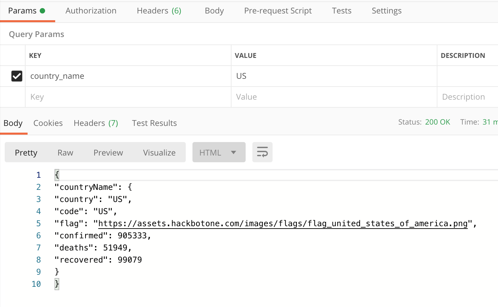
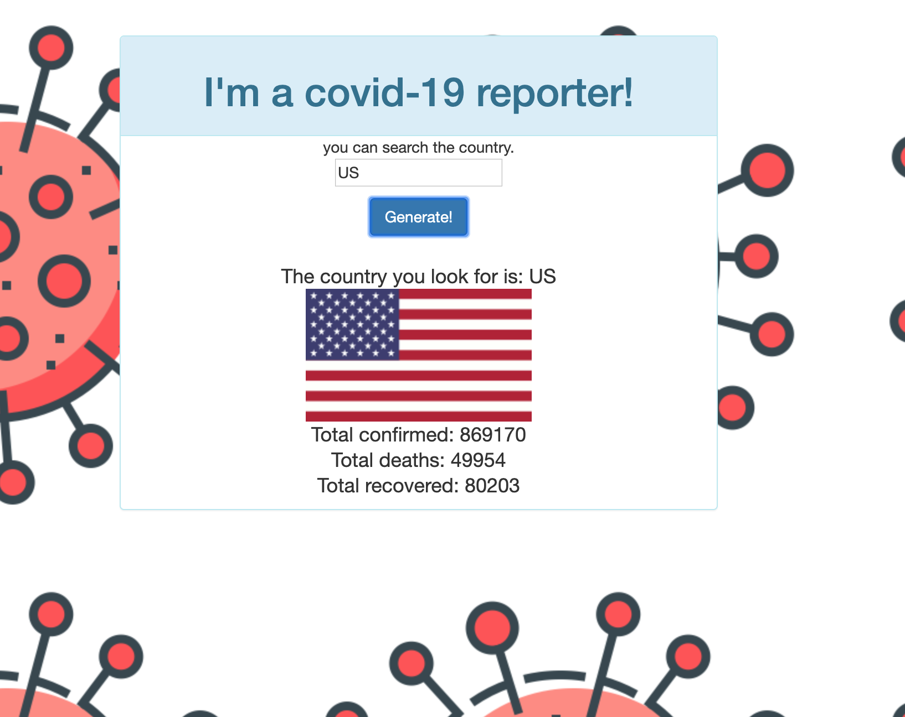

# Beat_Covid_19
A full stack project starter code for NodeJS.


The frontend is a simple web page that takes to country name: country_name and sends it to the backend using HTTP GET request.
The backend is a simple NodeJS server that processes the HTTP GET request, reads the parameters country_name and search its statsitics in database(got from CSSE at Johns Hopkins University (https://github.com/CSSEGISandData)) and returns the result back to the frontend.
By default frontend listens on port 8000, and backend listens on port 9000.

# Install NodeJS
You can install NodeJs from here.(https://nodejs.org/en/download/).

Running this package
To download and install:

```bash
git clone https://github.com/maddoxyuan1202/Beat_Covid_19.git
cd Beat_Covid_19
npm install
```
Running Backend:
```bash
cd backend
node app.js
```
You can test backend by installing and running Postman:



Running Frontend:
```bash
cd frontend
node app.js
```
Then open your browser to http://localhost:8000:

